# Concentrador de Datos LoRa a Wi-Fi (ESP32-S3 Gateway)

[](https://docs.espressif.com/projects/esp-idf/)
[](LICENSE)
[]()
[]()

> **Concentrador de Datos e Interfaz Gateway IoT** para aplicaciones de telemetría y medición inteligente (*smart metering*) residencial. Diseñado e implementado en la Facultad de Ingeniería de la Universidad Nacional de Asunción (FIUNA).

---

## 📌 Tabla de Contenidos
- [Descripción General](#-descripción-general)
- [Arquitectura del Sistema](#-arquitectura-del-sistema)
- [Especificaciones del Hardware](#-especificaciones-del-hardware)
- [Diseño Mecánico y Envolvente CAD](#-diseño-mecánico-y-envolvente-cad)
- [Métricas y Validación Experimental](#-métricas-y-validación-experimental)
- [Explicación Detallada del Firmware](#-explicación-detallada-del-firmware)
  - [Estrategia Multiprocesamiento (Dual-Core FreeRTOS)](#1-estrategia-multiprocesamiento-dual-core-freertos)
  - [Primitivas de Concurrencia](#2-primitivas-de-concurrencia)
  - [Driver de Pantalla OLED (SH1106 I2C Nativo ESP-IDF v6)](#3-driver-de-pantalla-oled-sh1106-i2c-nativo-esp-idf-v6)
  - [Gestión de Red, Eventos Wi-Fi y Hora SNTP (UTC-3)](#4-gestión-de-red-eventos-wi-fi-y-hora-sntp-utc-3)
  - [Capa de Almacenamiento Offline (SPIFFS)](#5-capa-de-almacenamiento-offline-spiffs)
  - [Recepción LoRa, Seguridad y Captura de Métricas RF](#6-recepción-lora-seguridad-y-captura-de-métricas-rf)
- [Mapeo de Pines y Conexiones](#-mapeo-de-pines-y-conexiones)
- [Estructura del Proyecto](#-estructura-del-proyecto)
- [Instrucciones de Compilación e Instalación](#-instrucciones-de-compilación-e-instalación)

---

## 🚀 Descripción General

El **Concentrador de Datos** actúa como un **Gateway o Puente Asíncrono bidireccional**:
1. **Captura por Radiofrecuencia (LoRa 433 MHz)**: Escucha de forma continua paquetes de datos de medidores de energía remotos utilizando el módem SX1278 (Ra-02).
2. **Filtrado y Decodificación**: Filtra tramas mediante firmas de hardware (`0xAA`) e IDs de dispositivo autorizados (`node_id < 5`), rechazando ruido o interferencias de redes externas.
3. **Retransmisión HTTP POST**: Formatea las variables de telemetría y las envía vía Wi-Fi hacia la base de datos central en un servidor PHP/MySQL usando autenticación mediante clave API (`X-API-Key`).
4. **Resiliencia Offline (SPIFFS)**: En caso de caída de la red Wi-Fi o del servidor, acumula las tramas en la memoria Flash interna (`/spiflash/unsent_tx.csv`). Al restablecerse la conectividad, vacía progresivamente los datos pendientes.
5. **Diagnóstico Local OLED**: Muestra métricas de calidad de enlace en tiempo real (RSSI, SNR), energía acumulada, contador total de paquetes y estado del canal/conexión en un display OLED SH1106 de 128x64 píxeles.

---

## 🏗 Arquitectura del Sistema

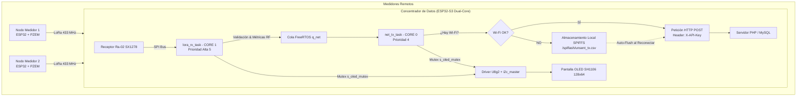

---

## 💻 Especificaciones del Hardware

El concentrador está construido sobre una tarjeta de circuito impreso (PCB) personalizada de 2 capas tipo SMD de **63 × 95 mm**:

- **Microcontrolador**: ESP32-S3-WROOM-1 (Dual Core 32-bit Xtensa LX7, Wi-Fi 802.11 b/g/n).
- **Módulo LoRa**: Ai-Thinker Ra-02 (Semtech SX1278, 433 MHz, interfaz SPI).
- **Alimentación**: Entrada de 5V DC mediante conector Jack o USB-C, regulada a 3.3V mediante regulador LDO AMS1117-3.3V con condensadores de desacoplo de `10µF` y `0.1µF`.
- **Reloj de Referencia RTC**: Cristal externo de `32.768 kHz` para funciones de sincronización y seguimiento de tiempo.
- **Interfaz OLED**: Display gráfico de 1.3" SH1106 128x64 píxeles conectado por bus I2C nativo.
- **Amplificador RF Auxiliar**: Módulo AB-IOT-433 y antena omnidireccional de 10 dBi para maximizar el alcance del enlace de radiofrecuencia.

| Componentes Principales | Vista 3D PCB Diseñada |
| :---: | :---: |
| 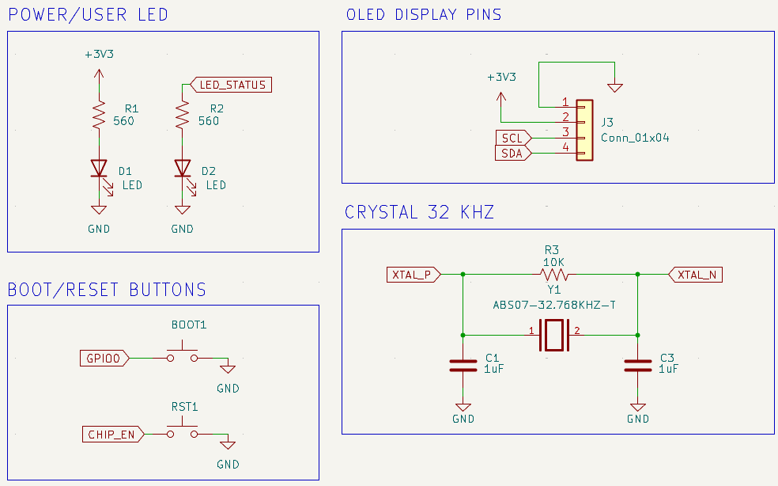 | 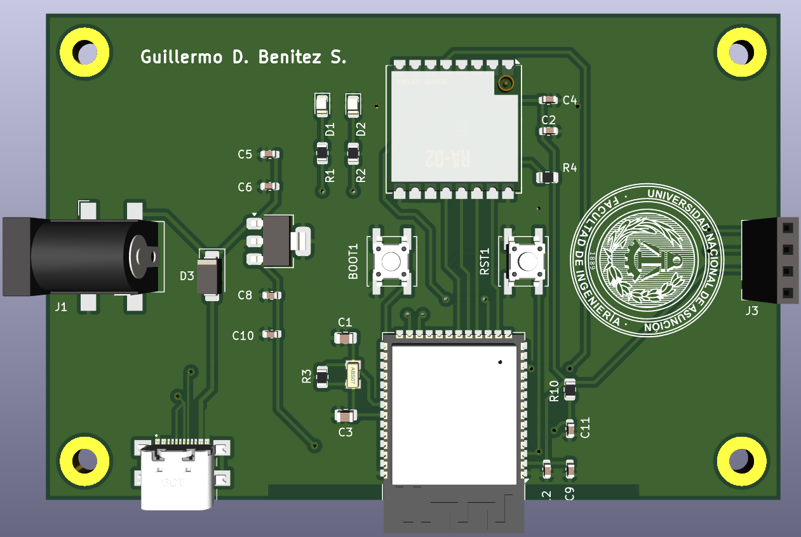 |

| Ruteado y Distribución | Plano de Masa GND |
| :---: | :---: |
| 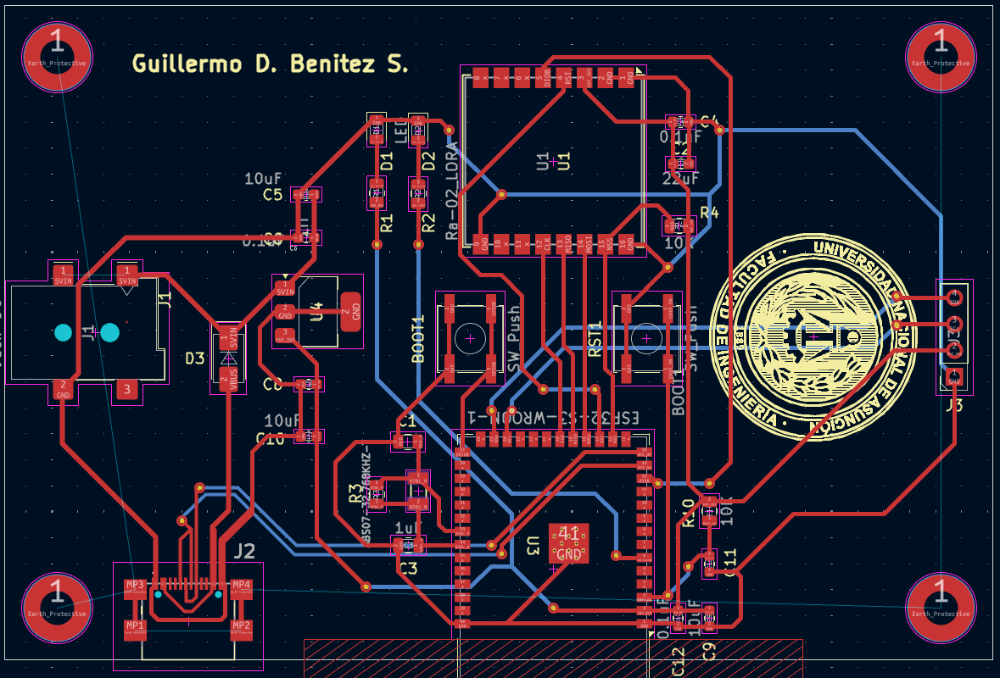 | 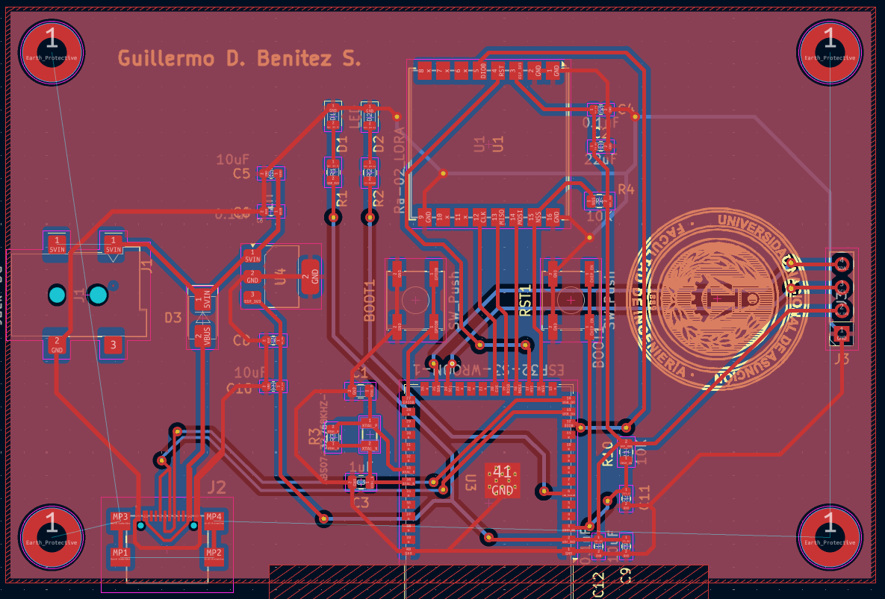 |

| Ensamble Completo de la Placa | Placa Funcional Construida |
| :---: | :---: |
| 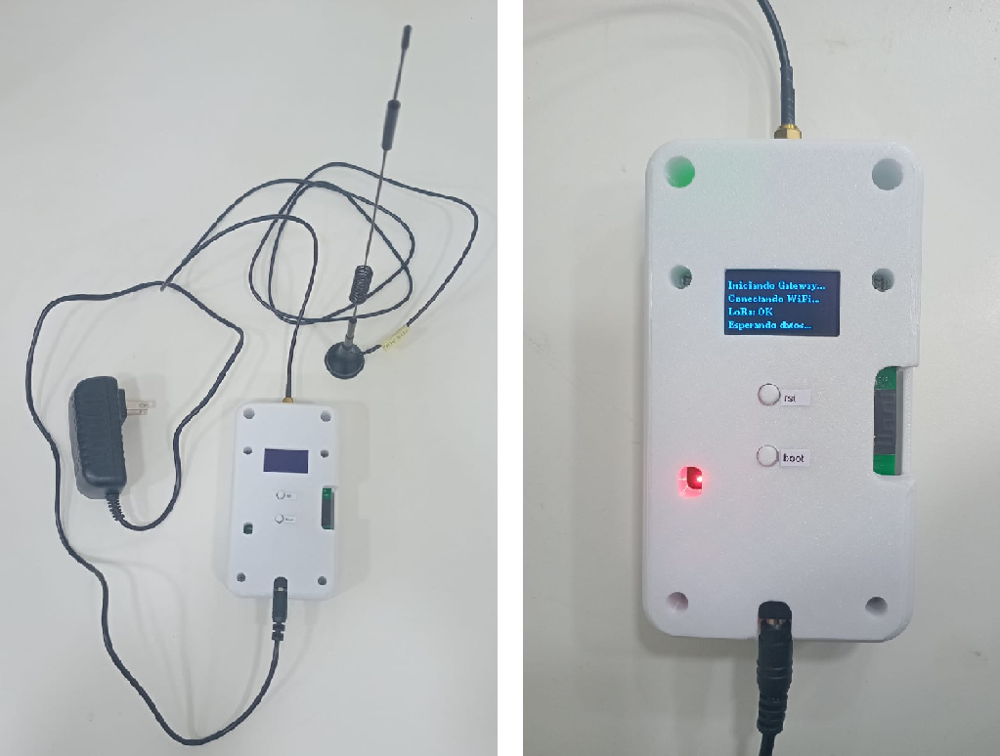 | 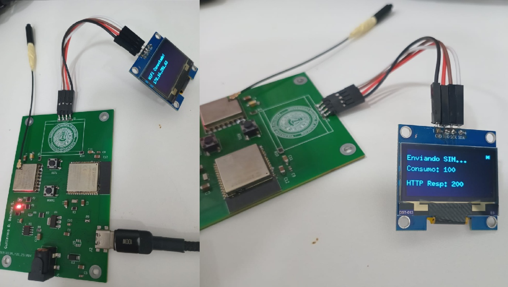 |

---

## 📐 Diseño Mecánico y Envolvente CAD

La envolvente protectora fue modelada en **SolidWorks**, adaptada a las dimensiones finales de la PCB de 63x95 mm, permitiendo el fácil montaje del puerto USB-C, conector de alimentación Jack, antena SMA, amplificador AB-IOT y display OLED.

| Vista de Vistas CAD | Ensamble Interno CAD |
| :---: | :---: |
| 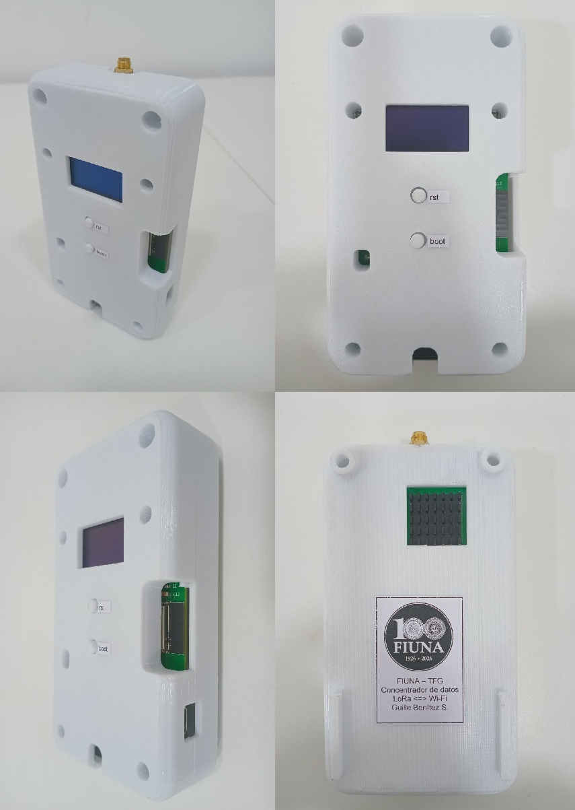 | 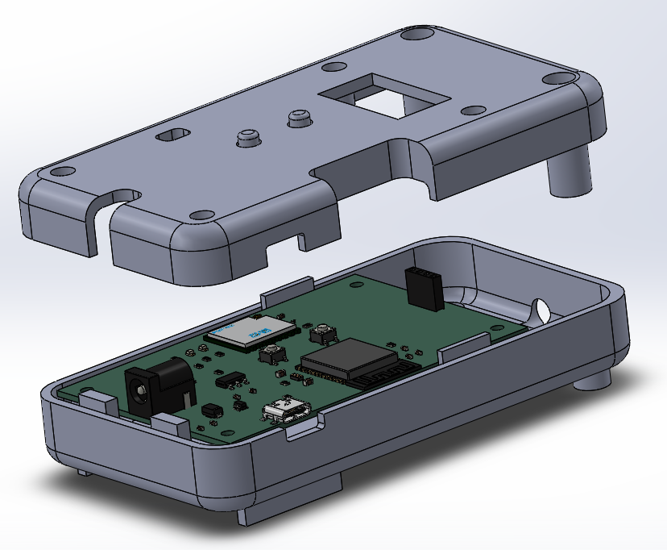 |

| Ensamble Físico Ensamblado | Tapa Superior Envolvente |
| :---: | :---: |
| 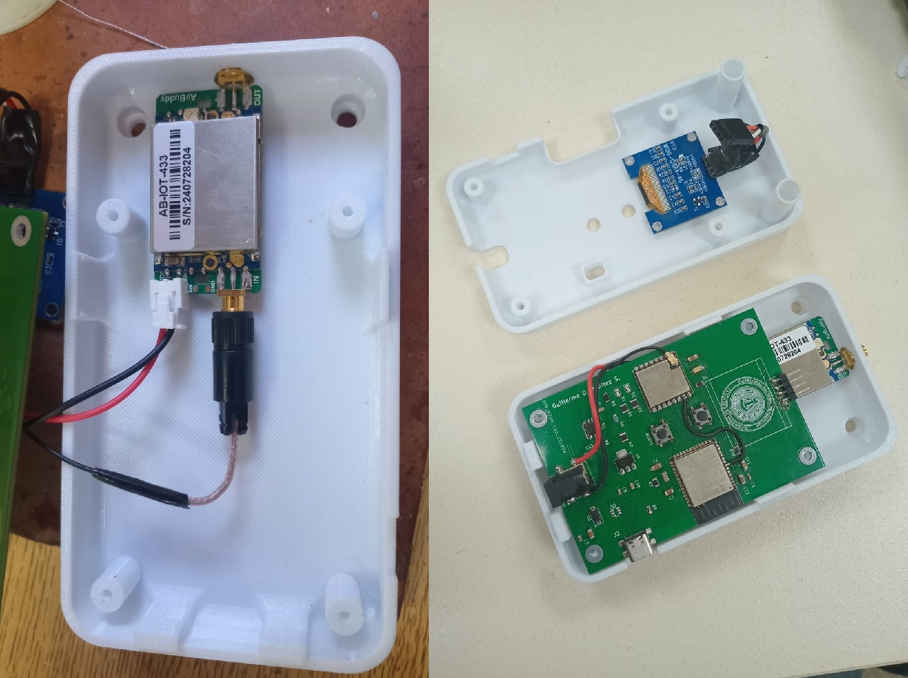 | 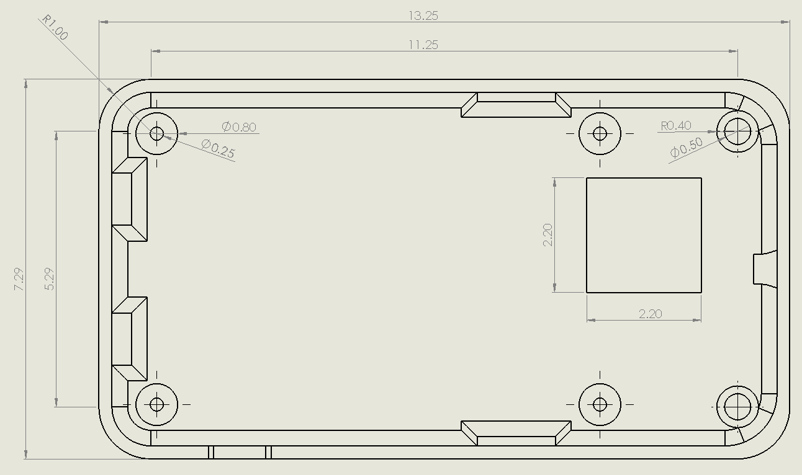 |

---

## 📊 Métricas y Validación Experimental

Las pruebas experimentales de validación se llevaron a cabo bajo condiciones de laboratorio y de campo en la FIUNA:

| Métrica de Rendimiento | Resultado Cuantitativo | Observaciones Técnicas |
| :--- | :---: | :--- |
| **Tasa de Recepción de Paquetes (PRR)** | **98.5%** | Rechazo de ruido optimizado mediante `SyncWord 0x55` y firma de hardware `0xAA`. |
| **Latencia de Procesamiento** | **< 15 ms** | Tiempo desde la interrupción `DIO0` hasta retornar al modo escucha. |
| **Consumo de Corriente Pico** | **~120 mA** | Medido durante ráfagas de transmisión Wi-Fi activa. |
| **Alcance / Cobertura RF** | **200 m – 8 km** | ~200 m en interiores/edificios y hasta 8 km en línea de visión directa (LOS). |

---

## 🧠 Explicación Detallada del Firmware (`main_concentrador.cpp`)

El firmware del concentrador está desarrollado en C++ utilizando el framework **ESP-IDF v6** y el sistema operativo en tiempo real **FreeRTOS**.

### 1. Estrategia Multiprocesamiento (Dual-Core FreeRTOS)

El procesador **ESP32-S3** posee dos núcleos independientes (Core 0 y Core 1). El sistema distribuye las cargas de trabajo de la siguiente manera:

```cpp
xTaskCreatePinnedToCore(wifi_supervisor_task, "wifi_sup", 4096, NULL, 4, NULL, 0); // Core 0
xTaskCreatePinnedToCore(net_tx_task,          "net_tx",   6144, NULL, 4, NULL, 0); // Core 0
xTaskCreatePinnedToCore(lora_rx_task,         "lora_rx",  4096, NULL, 5, NULL, 1); // Core 1
```

- **Núcleo 0 (Core 0)**: Asignado a las tareas de red TCP/IP (`wifi_sup` y `net_tx_task`). Ejecuta la reconexión Wi-Fi, la resolución DNS, las peticiones HTTP POST hacia la base de datos y la gestión del archivo CSV en memoria Flash.
- **Núcleo 1 (Core 1)**: Asignado de forma exclusiva a la tarea crítica de radiofrecuencia (`lora_rx_task`) con la máxima prioridad (`TASK_PRIO_LORA_RX = 5`). Al estar libre del tráfico Wi-Fi, garantiza la captura inmediata de paquetes sin pérdidas por latencia o bloqueo del procesador.

---

### 2. Primitivas de Concurrencia

Para evitar condiciones de carrera o corrupción de memoria entre tareas concurrentes:
- **`q_net` (QueueHandle_t)**: Cola de mensajes FreeRTOS con profundidad para 48 elementos (`NET_QUEUE_DEPTH`). Actúa como búfer intermedio entre `lora_rx_task` y `net_tx_task`.
- **`s_unsent_mutex` (SemaphoreHandle_t)**: Semáforo Mutex de archivo SPIFFS. Garantiza acceso exclusivo al archivo `/spiflash/unsent_tx.csv`.
- **`s_oled_mutex` (SemaphoreHandle_t)**: Semáforo Mutex de pantalla I2C. Protege el bus I2C y las rutinas de dibujo del display OLED SH1106.

---

### 3. Driver de Pantalla OLED (SH1106 I2C Nativo ESP-IDF v6)

Se implementa una función callback puente entre la biblioteca gráfica **U8g2** y la API nativa de I2C del ESP-IDF v6 (`driver/i2c_master.h`):

```cpp
uint8_t u8x8_byte_espidf_v6_i2c(u8x8_t *u8x8, uint8_t msg, uint8_t arg_int, void *arg_ptr) {
    static uint8_t buffer[512];
    static uint16_t buf_idx = 0;

    switch(msg) {
        case U8X8_MSG_BYTE_INIT: break;
        case U8X8_MSG_BYTE_START_TRANSFER: buf_idx = 0; break;
        case U8X8_MSG_BYTE_SEND: {
            uint8_t *data = (uint8_t *)arg_ptr;
            if (buf_idx + arg_int <= sizeof(buffer)) {
                memcpy(&buffer[buf_idx], data, arg_int);
                buf_idx += arg_int;
            }
            break;
        }
        case U8X8_MSG_BYTE_END_TRANSFER:
            if (buf_idx > 0 && oled_i2c_dev != NULL) {
                i2c_master_transmit(oled_i2c_dev, buffer, buf_idx, 100);
            }
            break;
        default: return 0;
    }
    return 1;
}
```

La interfaz de usuario renderiza 6 filas de diagnóstico dinámico en tiempo real:
- **Fila 1**: Título fijo `"LoRa ---> Wi-Fi"` y línea divisoria superior.
- **Fila 2**: Estado de conectividad (`WiFi OK` / `NO WiFi`) y hora de recepción del último paquete.
- **Fila 3**: Métricas físicas de RF: RSSI (potencia en dBm) y SNR (relación señal-ruido).
- **Fila 4**: Nodo emisor, canal activo y número de secuencia (`seq_min`).
- **Fila 5**: Telemetría de energía acumulada (`Wh`).
- **Fila 6**: Contador acumulativo total de paquetes válidos recibidos.

---

### 4. Gestión de Red, Eventos Wi-Fi y Hora SNTP (UTC-3)

- **Manejador de Eventos (`wifi_event_handler`)**: Responde asincrónicamente a los eventos `WIFI_EVENT` e `IP_EVENT`. Al obtener IP, marca `g_wifi_connected = true` e inicia inmediatamente la sincronización con el servidor NTP (`esp_netif_sntp_start()`).
- **Zona Horaria Oficial (`init_sntp_and_tz`)**: Configura la variable de entorno de zona horaria para Paraguay (UTC-3):
  ```cpp
  setenv("TZ", "<-03>3", 1);
  tzset();
  ```
- **Supervisión Wi-Fi (`wifi_supervisor_task`)**: Aplica un algoritmo de **Backoff Exponencial** en caso de desconexión (intenta reconectar cada 5s, 10s, 20s... hasta un tope de 60s), evitando saturar el router o el procesador.

---

### 5. Capa de Almacenamiento Offline (SPIFFS)

- **Transferencia HTTP POST (`net_post_payload`)**: Prepara una solicitud HTTP POST con el encabezado personalizado `X-API-Key: estacion_guille` y formato `application/x-www-form-urlencoded`:
  ```text
  tramar=1782815000,2,0.000123,220.50,1.23,150.75,0.832
  ```
- **Persistencia en Flash (`unsent_append_line`)**: Si no hay conexión Wi-Fi o el servidor responde con error, la trama se almacena en el archivo CSV interno `/spiflash/unsent_tx.csv`.
- **Vaciado Automático (`net_try_flush_unsent`)**: Al recuperar la conexión Wi-Fi, la tarea lee progresivamente el archivo CSV, envía las tramas acumuladas al servidor PHP una a una y limpia la memoria Flash de forma segura.

---

### 6. Recepción LoRa, Seguridad y Captura de Métricas RF

El módulo SX1278 (Ra-02) se configura a **433.0 MHz**, ancho de banda de **125 kHz** y **Spreading Factor 7 (SF7)** con la palabra de sincronización `SyncWord = 0x55`.

Estructura de trama empacada sin padding byte a byte (`22 bytes` reales):
```cpp
#pragma pack(push, 1)
typedef struct {
    uint8_t  node_id;   // ID del nodo
    uint32_t seq_min;   // Secuencia de minutos
    uint8_t  ch;        // Canal activo
    float    Energy;    // Energía acumulada (Wh)
    float    Vrms;      // Voltaje RMS (V)
    float    Irms;      // Corriente RMS (A)
    float    Pavg;      // Potencia Promedio (W)
    float    PF;        // Factor de Potencia
} LoRaPayload;          
#pragma pack(pop)
```

**Filtro de Seguridad**:
```cpp
if (packet.node_id < 5) {
    // Procesa el paquete legítimo, lee RSSI/SNR y lo coloca en q_net
} else {
    // Bloquea nodos no autorizados e indica "ID Intruso" en pantalla
}
```

---

## 📌 Mapeo de Pines y Conexiones

### Módulo LoRa SX1278 (Ra-02) — Bus SPI
| Señal | Pin ESP32-S3 | Descripción |
| :--- | :---: | :--- |
| `LORA_MOSI` | **GPIO 10** | Salida de Datos SPI |
| `LORA_MISO` | **GPIO 11** | Entrada de Datos SPI |
| `LORA_SCK`  | **GPIO 12** | Reloj del Bus SPI |
| `LORA_NSS`  | **GPIO 7**  | Seleccionador de Chip (CS) |
| `LORA_RST`  | **GPIO 9**  | Reset del Módulo RF |
| `LORA_DIO0` | **GPIO 8**  | Interrupción de Recepción |

### Pantalla OLED SH1106 — Bus I2C
| Señal | Pin ESP32-S3 | Descripción |
| :--- | :---: | :--- |
| `OLED_SCL` | **GPIO 47** | Reloj de Datos I2C |
| `OLED_SDA` | **GPIO 48** | Línea de Datos I2C |

---

## 📁 Estructura del Proyecto

```text
Concentrador/
├── main_concentrador.cpp        # Código fuente principal en C++ (Gateway ESP-IDF)
├── doc_concentrador.pdf         # Artículo científico y documentación técnica completa
├── Firmware_Explicación.docx    # Guía detallada del firmware y arquitectura de software
├── README.md                    # Documentación principal del repositorio
├── .gitignore                   # Archivos ignorados por Git
└── Imagenes/                    # Capturas, planos PCB, modelos 3D y diagramas CAD
    ├── AB-IOT-433.png
    ├── Alimentador.png
    ├── Antena10dBi.png
    ├── Completo.png
    ├── DB_concentr.png
    ├── ESP32.png
    ├── Modelo3D.png
    ├── PlanoGND.png
    ├── RA02.png
    ├── Ruteado.png
    ├── Tapa_sup.png
    ├── VARIOS1.png
    ├── VARIOS2.png
    ├── assembly.png
    ├── carcasa_sup.png
    ├── cuatro_vistas.jpg
    ├── ensamblaje.jpg
    ├── lateral1.png
    ├── lateral2.png
    └── placa_funcional.jpg
```

---

## 🛠 Instrucciones de Compilación e Instalación

### Requisitos Previos
1. **ESP-IDF v5.x / v6.x** instalado y configurado en el sistema.
2. Biblioteca **RadioLib** y **U8g2** agregadas al archivo `CMakeLists.txt` del proyecto ESP-IDF.

### Pasos de Compilación y Carga

```bash
# 1. Configurar el objetivo al microcontrolador ESP32-S3
idf.py set-target esp32s3

# 2. Compilar el proyecto
idf.py build

# 3. Flashear el firmware en el ESP32-S3
idf.py -p COMx flash

# 4. Abrir el monitor serie para ver el diagnóstico en tiempo real
idf.py -p COMx monitor
```

---

## 👨‍💻 Autores y Créditos

- **Guillermo Benítez** — Facultad de Ingeniería, Universidad Nacional de Asunción (FIUNA).
- **Asunción, Paraguay**.
